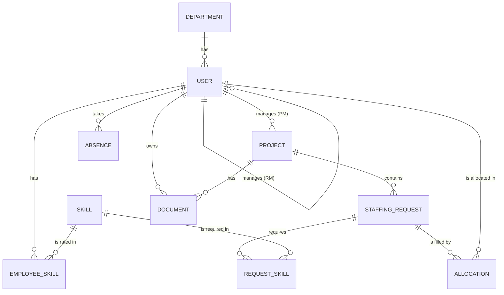
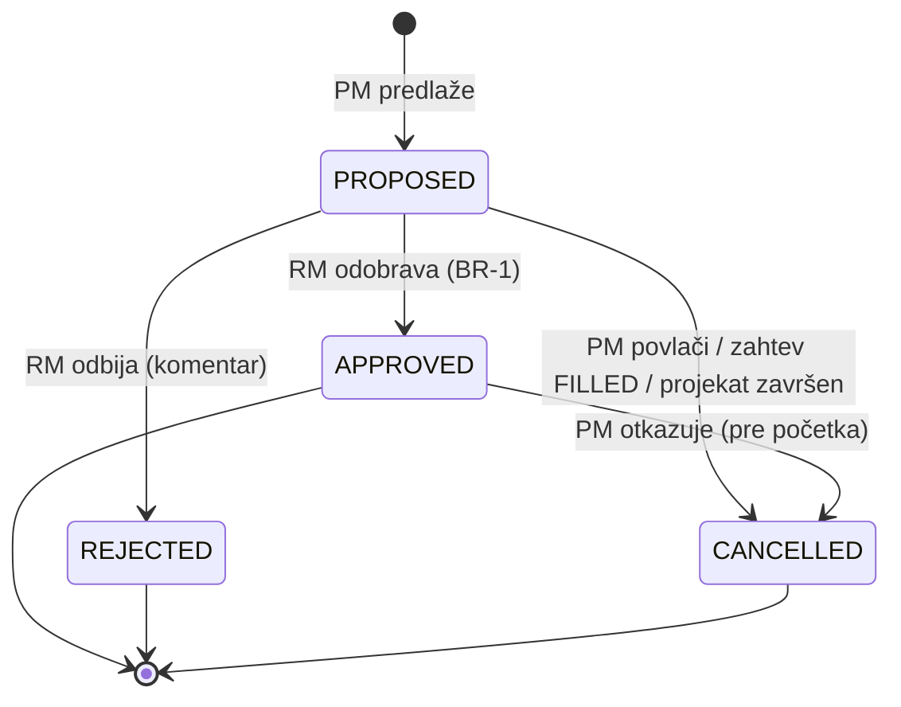
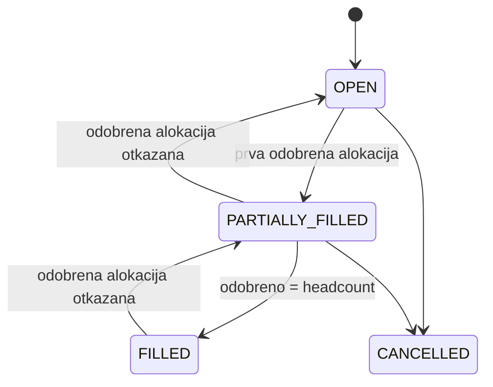

# StaffSync: sistem za raspoređivanje zaposlenih na projekte

> Capstone project proposal · Tim: 3 developera + 1 QA · Trajanje: 3 nedelje
> Radni naziv „StaffSync“ možete da promenite.

---

## Sadržaj

1. [Problem i pitch](#1-problem-i-pitch)
2. [Role](#2-role)
3. [Glavni scenario (demo tok)](#3-glavni-scenario-demo-tok)
4. [Domenski model](#4-domenski-model)
5. [Poslovna pravila](#5-poslovna-pravila)
6. [Kapacitet: kako se računa](#6-kapacitet-kako-se-računa)
7. [Matching engine](#7-matching-engine)
8. [Stanja (workflow)](#8-stanja-workflow)
9. [REST API](#9-rest-api)
10. [Angular stranice](#10-angular-stranice)
11. [Tehnologije i arhitektura](#11-tehnologije-i-arhitektura)
12. [Podela posla](#12-podela-posla)
13. [Plan po nedeljama](#13-plan-po-nedeljama)
14. [QA strategija i matrica testova](#14-qa-strategija-i-matrica-testova)
15. [MVP, stretch i van opsega](#15-mvp-stretch-i-van-opsega)
16. [Rizici](#16-rizici)

---

## 1. Problem i pitch

U većini IT firmi ljudi se raspoređuju na projekte preko Excel tabela, poruka i sastanaka. Posledice su uvek iste:

- **Prebukiranost.** Neko je istovremeno na tri projekta, a zbir zauzetosti mu je 140%, što niko ne primeti dok ne počnu da kasne rokovi.
- **Nevidljivi „bench“.** Ljudi bez projekta postoje, ali ih PM-ovi ne nalaze jer ne znaju ko šta zna niti ko je slobodan.
- **Spor i netransparentan proces.** PM pita line managera u porukama, odgovor se gubi, i nije jasno ko je šta odobrio.

**StaffSync** rešava ovo na jednom mestu. PM opiše koga traži (skillovi, nivo, procenat angažovanja, period), sistem predloži najbolje kandidate na osnovu skillova i stvarne dostupnosti, a line manager (RM) jednim klikom odobri ili odbije. Pravilo kapaciteta garantuje da niko ne može biti zauzet preko svog kapaciteta.

> **Rečenica za prezentaciju:** „Napravili smo alat kojim biste vi rasporedili nas posle onboardinga.“

---

## 2. Role

| Rola | Opis | Ključne akcije |
|---|---|---|
| **Employee** | Svaki zaposleni | Održava profil i skillove (nivo 1–5), uploaduje CV, vidi svoje alokacije, prijavljuje odsustva *(stretch)* |
| **Project Manager (PM)** | Vodi jedan ili više projekata | Kreira projekte i staffing zahteve, pregleda rangirane kandidate, predlaže alokacije, otkazuje predloge |
| **Resource Manager (RM)** | Line manager tima zaposlenih | Odobrava ili odbija alokacije svojih ljudi, odobrava odsustva *(stretch)*, prati zauzetost tima |
| **Admin** | Administracija sistema | Upravlja korisnicima, rolama, departmentima i katalogom skillova |

Svaki korisnik ima tačno jednu rolu. Svaki Employee ima tačno jednog RM-a (`manager_id`).

---

## 3. Glavni scenario (demo tok)

1. **Ana (PM)** kreira projekat *Project Alpha* (1.11–31.3).
2. Ana kreira staffing zahtev: *„Java Developer“*, MEDIOR, **60%**, 1.11–31.1, headcount 2, skillovi: Java ≥ 4 (obavezno), Spring ≥ 3 (obavezno), PostgreSQL ≥ 2 (poželjno).
3. Sistem vraća **rangiranu listu kandidata**:
   - *Marko, 85/100:* Java 5/5, Spring 4/5, PostgreSQL 3/5, slobodan ceo period (SENIOR, traženo MEDIOR).
   - *Jelena, 67/100:* Java 4/5, Spring 3/5, bez PostgreSQL-a, slobodna 40% do 14.11, a od 15.11 100%. ⚠ Nedovoljan kapacitet 1–14.11.
   - …
4. Ana predlaže Marka. Alokacija dobija status `PROPOSED`.
5. **Igor (RM)**, Markov line manager, vidi zahtev na čekanju i odobrava ga. Alokacija prelazi u `APPROVED`, a zahtev u `PARTIALLY_FILLED` (1 od 2).
6. Ana predlaže Jelenu za ceo period. Njen RM pokušava da odobri, ali sistem odbija sa porukom: *„Kapacitet prekoračen 2.11–13.11 (60% postojeće + 60% novo = 120%)“*.
7. Ana menja period Jeleninog predloga na 15.11–31.1. RM odobrava, a zahtev postaje `FILLED`.

Ovaj tok je ujedno i scenario za demo na prezentaciji.

---

## 4. Domenski model



### Entiteti

| Entitet | Polja | Napomena |
|---|---|---|
| `User` | id, email (unique), passwordHash, firstName, lastName, role, department_id, manager_id, capacityPercent, seniority, active | `capacityPercent` ∈ {100, 80, 50}. `seniority` ∈ {JUNIOR, MEDIOR, SENIOR} |
| `Department` | id, name (unique) | |
| `Skill` | id, name (unique), category | Kategorije: BACKEND, FRONTEND, DATABASE, DEVOPS, QA, OTHER |
| `EmployeeSkill` | id, user_id, skill_id, level (1–5), yearsOfExperience | Kombinacija (user, skill) je unique |
| `Project` | id, name, client, description, startDate, endDate, status, pm_id | Status: PLANNED / ACTIVE / COMPLETED / CANCELLED |
| `StaffingRequest` | id, project_id, title, seniority, allocationPercent, startDate, endDate, headcount, status, createdAt | `allocationPercent` ∈ [10, 100], u koracima od 10 |
| `RequestSkill` | id, request_id, skill_id, minLevel, mandatory | |
| `Allocation` | id, request_id, employee_id, percent, startDate, endDate, status, proposedBy_id, decidedBy_id, decisionComment, createdAt, decidedAt | `percent` se podrazumevano preuzima iz zahteva |
| `Absence` *(stretch)* | id, employee_id, type, startDate, endDate, status, decidedBy_id | Type: VACATION / SICK / OTHER |
| `Document` *(stretch)* | id, ownerType, ownerId, fileName, contentType, size, storagePath, uploadedBy_id, uploadedAt | Fajlovi se čuvaju na disku, u bazi su samo metapodaci |

---

## 5. Poslovna pravila

Ova pravila su srž projekta. Implementiraju se u service layer-u, a QA ih pokriva testovima.

| # | Pravilo | Greška |
|---|---|---|
| **BR-1** | **Kapacitet kroz vreme.** Za svaki radni dan u periodu alokacije: zbir `APPROVED` alokacija zaposlenog + nova alokacija ≤ `capacityPercent`. Na dane odobrenog odsustva kapacitet je 0. | 409 Conflict, uz listu dana koji prelaze kapacitet |
| **BR-2** | Provera iz BR-1 je **obavezna pri odobravanju**. Pri predlaganju sistem samo **upozorava** ako bi zbir `APPROVED` + `PROPOSED` alokacija prešao kapacitet (soft booking). | Pri odobravanju greška; pri predlogu samo upozorenje u odgovoru |
| **BR-3** | Period alokacije mora biti unutar perioda zahteva, a period zahteva unutar perioda projekta. `startDate ≤ endDate`. | 400 Bad Request |
| **BR-4** | Staffing zahteve kreira i kandidate predlaže samo PM tog projekta. | 403 Forbidden |
| **BR-5** | Alokaciju odobrava ili odbija samo RM kome zaposleni pripada (`employee.manager_id`). | 403 Forbidden |
| **BR-6** | Za odbijanje alokacije komentar je obavezan (min. 10 karaktera). | 400 Bad Request |
| **BR-7** | Odlučuje se samo o alokacijama u statusu `PROPOSED`. Odobrena ili odbijena alokacija se ne može ponovo odobriti ni odbiti. | 409 Conflict |
| **BR-8** | Isti zaposleni ne može imati dve aktivne alokacije (`PROPOSED` ili `APPROVED`) na istom zahtevu u periodima koji se preklapaju. | 409 Conflict |
| **BR-9** | Predlaganje je dozvoljeno samo na zahtevu u statusu `OPEN` ili `PARTIALLY_FILLED`, i to samo ako zaposleni ispunjava sve obavezne skillove. | 409 / 400 |
| **BR-10** | Status zahteva se računa automatski: 0 odobrenih = `OPEN`, između 1 i headcount−1 = `PARTIALLY_FILLED`, headcount = `FILLED`. Kad je zahtev `FILLED`, preostali `PROPOSED` predlozi se automatski otkazuju. | – |
| **BR-11** | Kad se projekat završi ili otkaže, svi njegovi otvoreni zahtevi i `PROPOSED` alokacije se otkazuju, a `APPROVED` alokacije se skraćuju do tog dana. | – |
| **BR-12** | Korisnik sa aktivnim (`APPROVED`, tekućim ili budućim) alokacijama ne može biti deaktiviran. | 409 Conflict |
| **BR-13** | Smanjenje `capacityPercent` zaposlenog nije dozvoljeno ako bi postojeće `APPROVED` alokacije prekoračile novi kapacitet. | 409 Conflict |
| **BR-14** *(stretch)* | Odsustvo odobrava RM zaposlenog. Ako se preklapa sa `APPROVED` alokacijom, odobravanje je dozvoljeno, ali se konflikt prikazuje PM-u i RM-u. | Upozorenje |

---

## 6. Kapacitet: kako se računa

**Zašto procenat, a ne sati?** U IT firmama se o raspoređivanju priča u procentima („50% na projektu A“), a sati su tema timesheet-a i naplate. Procenat daje jedno pravilo umesto da se prate različiti ugovori i praznici. Za prikaz u UI-ju se procenat preračunava u sate: 60% od 40h = 24h nedeljno.

**Algoritam.** `CapacityService.getDailyLoad(employeeId, from, to)` vraća mapu `datum → zauzetost u %` samo za radne dane (pon–pet). Perioda su najviše nekoliko meseci, pa je prolazak dan po dan sasvim dovoljno brz, a kod ostaje čitljiv i lak za testiranje.

```text
Marko, capacityPercent = 100
  Projekat A: 60%, 1.11–15.12   (APPROVED)
  Projekat B: 30%, 10.11–31.12  (APPROVED)
  Odsustvo:   12.11–14.11       (APPROVED)

Novi predlog: Projekat C, 20%, 5.11–20.11

  5.11–9.11:   60        + 20 =  80% ✅
  10.11–11.11: 60 + 30   + 20 = 110% ❌
  12.11–14.11: odsustvo (kapacitet 0) ❌
  15.11–20.11: 60 + 30   + 20 = 110% ❌

=> 409 Conflict: kapacitet prekoračen 10.11–20.11
```

**Slobodan kapacitet** za dan = `capacityPercent − zauzetost` (0 na dan odsustva). Isti metod koriste i matching engine i pretraga zaposlenih.

---

## 7. Matching engine

`GET /api/requests/{id}/candidates` vraća kandidate sortirane po skoru (0–100), sa objašnjenjem.

### Korak 1: filter
- Zaposleni je aktivan i ima rolu EMPLOYEE.
- Zaposleni ima **sve obavezne** skillove na nivou ≥ `minLevel`.
- Zaposleni nema aktivnu alokaciju na istom zahtevu.

### Korak 2: skor

| Komponenta | Težina | Računanje |
|---|---|---|
| **Skillovi** | 50% | Za svaki traženi skill se računa poklapanje: obavezni skill na minimalnom nivou = 0,7, svaki nivo iznad minimuma +0,1 (najviše 1,0); poželjni skill nosi isto, a ako ga kandidat nema = 0. Prosek se množi sa 50. |
| **Dostupnost** | 40% | Udeo radnih dana u periodu na kojima je slobodan kapacitet ≥ traženi procenat. Množi se sa 40. |
| **Seniority** | 10% | Isti nivo = 10, susedni nivo = 5, ostalo = 0. |

### Korak 3: objašnjenje
Svaki kandidat u odgovoru ima `reasons[]` i `warnings[]`:

```json
{
  "employeeId": 17,
  "fullName": "Jelena Petrović",
  "score": 67,
  "breakdown": { "skills": 23, "availability": 34, "seniority": 10 },
  "reasons": ["Java 4/5 (traženo ≥ 4)", "Spring 3/5 (traženo ≥ 3)"],
  "warnings": ["Nedovoljan kapacitet 1.11–14.11 (slobodno 40%, traženo 60%)", "Nema PostgreSQL (poželjno)"]
}
```

Ovo je deo koji projekat odvaja od običnog CRUD-a. `MatchingService` zavisi samo od `CapacityService` i repozitorijuma, pa se skor lako testira jediničnim testovima sa mock podacima.

---

## 8. Stanja (workflow)

### Allocation



### Staffing request



### Project
`PLANNED → ACTIVE → COMPLETED`; iz `PLANNED` ili `ACTIVE` projekat može preći u `CANCELLED` (vidi BR-11).

---

## 9. REST API

Svi endpointi osim login-a zahtevaju JWT (`Authorization: Bearer …`). Liste podržavaju `page`, `size` i `sort`.

### Auth
| Metod | Putanja | Rola | Opis |
|---|---|---|---|
| POST | `/api/auth/login` | javno | Vraća JWT i osnovne podatke o korisniku |
| GET | `/api/auth/me` | svi | Trenutni korisnik |

### Korisnici, departmenti, skillovi
| Metod | Putanja | Rola | Opis |
|---|---|---|---|
| GET | `/api/users` | ADMIN, RM | Lista sa filterima (department, role, active) |
| POST / PUT | `/api/users`, `/api/users/{id}` | ADMIN | Kreiranje i izmena (BR-12, BR-13) |
| PATCH | `/api/users/{id}/deactivate` | ADMIN | Deaktivacija (BR-12) |
| GET / PUT | `/api/users/{id}/skills` | vlasnik, ADMIN (izmena); svi (čitanje) | Skillovi zaposlenog |
| GET | `/api/users/{id}/availability?from&to` | PM, RM, vlasnik | Dnevna zauzetost i slobodan kapacitet |
| GET | `/api/users/me/team` | RM | Moj tim sa trenutnom zauzetošću |
| CRUD | `/api/departments` | ADMIN (izmena), svi (čitanje) | |
| CRUD | `/api/skills` | ADMIN (izmena), svi (čitanje) | |

### Projekti i zahtevi
| Metod | Putanja | Rola | Opis |
|---|---|---|---|
| GET | `/api/projects?status&pmId` | svi | Lista projekata |
| POST / PUT | `/api/projects`, `/api/projects/{id}` | PM | Kreiranje i izmena sopstvenog projekta |
| PATCH | `/api/projects/{id}/status` | PM (vlasnik) | Promena statusa (BR-11) |
| GET / POST | `/api/projects/{id}/requests` | PM (vlasnik); svi (čitanje) | Staffing zahtevi projekta (BR-3, BR-4) |
| GET / PUT / DELETE | `/api/requests/{id}` | PM (vlasnik) | Detalji, izmena, otkazivanje |
| GET | `/api/requests/{id}/candidates` | PM (vlasnik) | **Matching engine** |

### Alokacije
| Metod | Putanja | Rola | Opis |
|---|---|---|---|
| POST | `/api/allocations` | PM | Predlog (BR-2, BR-3, BR-8, BR-9) |
| GET | `/api/allocations?status&employeeId&projectId&from&to` | svi (filtrirano po roli) | Pretraga alokacija |
| GET | `/api/allocations/pending` | RM | Na čekanju za moj tim |
| POST | `/api/allocations/{id}/approve` | RM | Odobravanje (BR-1, BR-5, BR-7, BR-10) |
| POST | `/api/allocations/{id}/reject` | RM | Odbijanje (BR-5, BR-6, BR-7) |
| POST | `/api/allocations/{id}/cancel` | PM | Povlačenje ili otkazivanje |

### Pretraga zaposlenih
| Metod | Putanja | Rola | Opis |
|---|---|---|---|
| GET | `/api/employees/search?skillId&minLevel&seniority&departmentId&availableFrom&availableTo&minFreePercent` | PM, RM | Napredna pretraga sa paginacijom i sortiranjem |

### Stretch
| Metod | Putanja | Rola | Opis |
|---|---|---|---|
| GET / POST | `/api/absences` | EMPLOYEE (svoja), RM (tim) | Prijava i pregled odsustava |
| POST | `/api/absences/{id}/approve`, `/reject` | RM | BR-14 |
| POST | `/api/documents` (multipart) | vlasnik / PM | Upload CV-a ili dokumenta projekta (PDF/DOCX, max 5 MB) |
| GET / DELETE | `/api/documents/{id}` | ovlašćeni | Download i brisanje |
| GET | `/api/users/me/team/timeline?from&to` | RM | Nedeljna zauzetost tima za heatmap |

### Format greške (globalni `@ControllerAdvice`)
```json
{
  "timestamp": "2026-11-03T10:15:30Z",
  "status": 409,
  "code": "CAPACITY_EXCEEDED",
  "message": "Kapacitet prekoračen za 3 dana",
  "details": [{ "date": "2026-11-10", "load": 110 }]
}
```

---

## 10. Angular stranice

**Zajedničko:** login, layout sa menijem koji zavisi od role, `AuthGuard` i `RoleGuard`, JWT `HttpInterceptor`, globalni error handler (snackbar), pretraga zaposlenih.

| Rola | Stranice |
|---|---|
| **Employee** | *Moj profil* (podaci, skillovi sa nivoima, CV upload), *Moje alokacije* (lista i trenutna zauzetost), *Moja odsustva* *(stretch)* |
| **PM** | *Moji projekti* (lista i filteri), *Detalji projekta* (zahtevi, tim, dokumenti), *Novi/izmena zahteva* (reactive form sa dinamičkom listom skillova), **Kandidati** (rangirana lista, breakdown skora, upozorenja, dugme „Predloži“) |
| **RM** | *Na čekanju* (approve/reject dijalog sa komentarom), *Moj tim* (lista sa trenutnom zauzetošću), **Timeline/heatmap** *(stretch)* (redovi = ljudi, kolone = nedelje, boja = zauzetost) |
| **Admin** | *Korisnici*, *Departmenti*, *Katalog skillova* |

**Reusable komponente:** `skill-level-picker`, `capacity-bar` (traka zauzetosti), `status-chip`, `date-range-picker`, `confirm-dialog`, `paged-table`.

---

## 11. Tehnologije i arhitektura

| Sloj | Tehnologije |
|---|---|
| Backend | Java 21, Spring Boot 3, Spring Web, Spring Data JPA, Spring Security + JWT, Bean Validation, Flyway, springdoc-openapi |
| Baza | PostgreSQL (lokalno preko `docker-compose`) |
| Frontend | Angular (standalone komponente), Angular Material, Reactive Forms, RxJS |
| Testovi | JUnit 5, Mockito, Spring Boot Test, Testcontainers, REST Assured, Playwright |
| Alati | Git (feature grane, PR, code review), GitHub Issues/Projects za backlog |

### Struktura backenda (paketi po feature-ima)
```text
com.staffsync
├── auth/          (JwtService, SecurityConfig, AuthController)
├── user/          (User, UserController, UserService, UserRepository, dto/)
├── skill/
├── department/
├── project/
├── request/       (StaffingRequest, RequestSkill, ...)
├── allocation/    (Allocation, AllocationService, CapacityService)
├── matching/      (MatchingService, CandidateDto)
├── absence/       (stretch)
├── document/      (stretch)
└── common/        (GlobalExceptionHandler, BusinessException, ErrorResponse)
```

Slojevi: **Controller → Service → Repository**. Entiteti se nikad ne vraćaju direktno, već preko DTO-a. Poslovna pravila žive isključivo u servisima.

### Seed podaci
Flyway migracija sa demo podacima: 4 departmenta, oko 25 skillova, oko 30 zaposlenih sa različitim skillovima i kapacitetima (uključujući part-time), 3 PM-a, 3 RM-a, 5 projekata i nekoliko postojećih alokacija, tako da matching ima šta da pokaže.

---

## 12. Podela posla

Rad je podeljen na vertikalne slice-ove: svaki developer radi i backend i frontend svog dela (50/50).

| Član | Odgovornost |
|---|---|
| **Dev 1: Platforma i korisnici** | Setup projekta (Spring Boot, Angular, docker-compose, Flyway), Spring Security + JWT, guardovi i interceptor, korisnici, departmenti, skillovi, profil zaposlenog, admin stranice, seed podaci. *Stretch:* upload dokumenata (CV i dokumenti projekta). |
| **Dev 2: Projekti i matching** | Projekti, staffing zahtevi (forma sa dinamičkim skillovima), **MatchingService**, stranica kandidata, pretraga zaposlenih, PM stranice. |
| **Dev 3: Alokacije i kapacitet** | **CapacityService**, alokacije (predlog, odobravanje, odbijanje, otkazivanje), automatski status zahteva, RM stranice, availability endpoint. *Stretch:* odsustva i timeline/heatmap. |
| **QA** | Test plan, matrica testova iz poslovnih pravila, unit testovi za `CapacityService` i `MatchingService`, integracioni testovi (Testcontainers), API automatizacija (REST Assured), E2E (Playwright), matrica ovlašćenja, bug reporting kroz GitHub Issues. |

**Git workflow:** `main` je uvek stabilan. Feature grane se zovu `feature/<kratak-opis>`. Svaki PR traži review bar jednog developera, a QA proverava pre merge-a gde je moguće.

---

## 13. Plan po nedeljama

### Nedelja 1: temelji
| Član | Zadaci |
|---|---|
| Dev 1 | Kostur repoa i oba projekta, docker-compose, Flyway V1, auth/JWT end-to-end (login stranica), layout i guardovi |
| Dev 2 | Entiteti i CRUD za projekte i staffing zahteve (backend), PM lista projekata |
| Dev 3 | Entiteti za alokacije, `CapacityService` sa unit testovima za osnovne slučajeve, availability endpoint |
| QA | Test plan, test case-ovi iz BR-1…BR-14, setup REST Assured i Testcontainers projekta |

**Cilj kraja nedelje:** login radi, korisnici, skillovi i projekti postoje u bazi i vide se u UI-ju.

### Nedelja 2: srž sistema
| Član | Zadaci |
|---|---|
| Dev 1 | Profil i skillovi zaposlenog, admin stranice, seed demo podataka |
| Dev 2 | `MatchingService`, stranica kandidata, forma zahteva, pretraga zaposlenih |
| Dev 3 | Tok predlog → odobravanje/odbijanje, BR-1…BR-13, RM stranice |
| QA | API testovi za alokacije i ovlašćenja, unit testovi za capacity i matching, prvi bug reportovi |

**Cilj kraja nedelje:** ceo demo scenario iz sekcije 3 radi od početka do kraja.

### Nedelja 3: stretch, kvalitet i prezentacija
| Dan | Fokus |
|---|---|
| 1–3 | Stretch: odsustva (Dev 3), upload dokumenata (Dev 1), timeline/heatmap (Dev 2 i Dev 3) |
| 3 (kraj dana) | **Feature freeze** |
| 4 | Ispravljanje bagova, UI polish, finalni seed podaci |
| 5 | Probna prezentacija, demo scenario, README |

QA u trećoj nedelji radi E2E testove glavnog toka, regresiju i finalni test izveštaj.

---

## 14. QA strategija i matrica testova

### Nivoi testiranja
- **Unit:** `CapacityService` (zbir po danu, granice perioda, vikendi, odsustva), `MatchingService` (filter, skor, sortiranje).
- **Integracioni:** repozitorijumi i servisi nad pravim PostgreSQL-om (Testcontainers).
- **API:** REST Assured, svi endpointi, statusni kodovi i format grešaka.
- **E2E:** Playwright, glavni scenario po rolama.
- **Ovlašćenja:** matrica rola × endpoint (200 / 403 / 401).

### Matrica testova (izvod)

| ID | Pravilo | Scenario | Očekivano |
|---|---|---|---|
| T-01 | BR-1 | Postojeće 40% + novo 60% = tačno 100% | 200, APPROVED |
| T-02 | BR-1 | Postojeće 50% + novo 60% = 110% | 409 CAPACITY_EXCEEDED |
| T-03 | BR-1 | Postojeća alokacija se završava 10.11, nova počinje 10.11 (preklapanje na granici) | 409 ako zbir > 100 |
| T-04 | BR-1 | Postojeća se završava 9.11, nova počinje 10.11 | 200 |
| T-05 | BR-1 | Part-time (50%) zaposleni, novo 60% | 409 |
| T-06 | BR-1 | Preklapanje samo vikendom | 200 (vikendi se ne računaju) |
| T-07 | BR-1 | Odobreno odsustvo usred perioda alokacije | 409 |
| T-08 | BR-2 | Predlog koji sa PROPOSED alokacijama prelazi kapacitet | 201 + upozorenje |
| T-09 | BR-3 | Alokacija počinje pre početka zahteva | 400 |
| T-10 | BR-3 | `endDate` < `startDate` | 400 |
| T-11 | BR-4 | PM predlaže na tuđem projektu | 403 |
| T-12 | BR-5 | RM odobrava zaposlenog iz drugog tima | 403 |
| T-13 | BR-5 | Employee pokušava da odobri | 403 |
| T-14 | BR-6 | Odbijanje bez komentara ili sa komentarom kraćim od 10 karaktera | 400 |
| T-15 | BR-7 | Ponovno odobravanje APPROVED alokacije | 409 |
| T-16 | BR-8 | Isti zaposleni predložen dvaput na isti zahtev | 409 |
| T-17 | BR-9 | Predlog na FILLED ili CANCELLED zahtev | 409 |
| T-18 | BR-9 | Predlog zaposlenog bez obaveznog skilla | 400 |
| T-19 | BR-10 | Headcount 2, odobrene 2 alokacije | Zahtev FILLED, ostali predlozi CANCELLED |
| T-20 | BR-10 | Otkazana odobrena alokacija na FILLED zahtevu | Zahtev PARTIALLY_FILLED |
| T-21 | BR-11 | Projekat otkazan | Otvoreni zahtevi i PROPOSED alokacije CANCELLED |
| T-22 | BR-12 | Deaktivacija zaposlenog sa aktivnom alokacijom | 409 |
| T-23 | BR-13 | Smanjenje kapaciteta sa 100% na 50% uz postojećih 80% | 409 |
| T-24 | Matching | Kandidat bez obaveznog skilla | Nije u listi |
| T-25 | Matching | Dva kandidata, isti skillovi, različita dostupnost | Dostupniji je rangiran više |
| T-26 | Auth | Istekao JWT | 401 |
| T-27 | Auth | Pogrešna lozinka | 401, bez otkrivanja da li email postoji |
| T-28 | Upload *(stretch)* | Fajl > 5 MB ili `.exe` | 400 |

---

## 15. MVP, stretch i van opsega

### MVP (mora da bude gotovo)
- Auth (JWT) i 4 role sa guardovima
- Korisnici, departmenti, skillovi, profil zaposlenog
- Projekti i staffing zahtevi
- **Matching engine** sa skorom i objašnjenjem
- **Tok alokacija** sa pravilima BR-1 do BR-13
- Pretraga zaposlenih po skillu i dostupnosti
- Seed podaci i demo scenario

### Stretch (redosledom prioriteta)
1. **Odsustva:** prijava, odobravanje, uticaj na kapacitet (BR-14)
2. **Upload CV-a i dokumenata projekta**
3. **Timeline/heatmap** zauzetosti tima

### Van opsega (svesno izostavljeno)
- Email notifikacije, real-time (WebSocket)
- Analitika i izveštaji
- Audit log
- Mikroservisi, Kafka, AI

---

## 16. Rizici

| Rizik | Mitigacija |
|---|---|
| Matching ispadne previše jednostavan i projekat izgleda kao CRUD | Matching i capacity su prioritet u drugoj nedelji, a objašnjenje skora je obavezan deo MVP-a |
| Greške u računanju kapaciteta na granicama datuma | Pravilo je definisano unapred (sekcija 6), a QA piše testove za granice pre implementacije |
| Integracija frontenda i backenda kasni | API ugovor (DTO-i i OpenAPI) dogovoren u prvoj nedelji, frontend može da radi sa mock podacima |
| Previše stretch funkcionalnosti | Feature freeze na kraju 3. dana treće nedelje, bez izuzetaka |
| Merge konflikti u istim fajlovima | Paketi po feature-ima, mali i česti PR-ovi |
