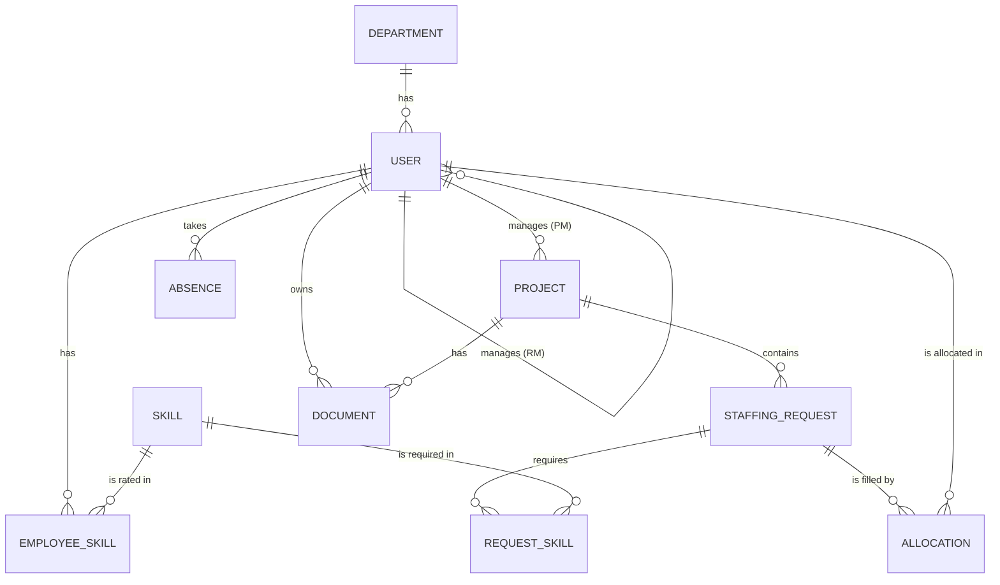
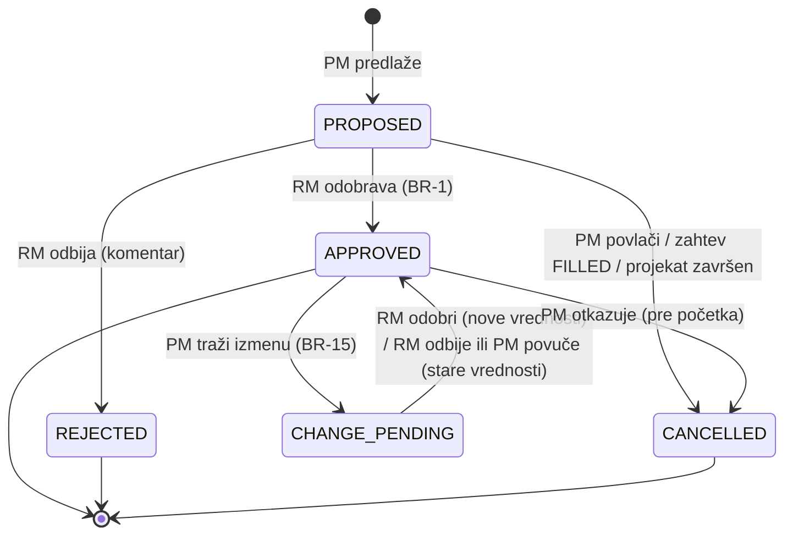
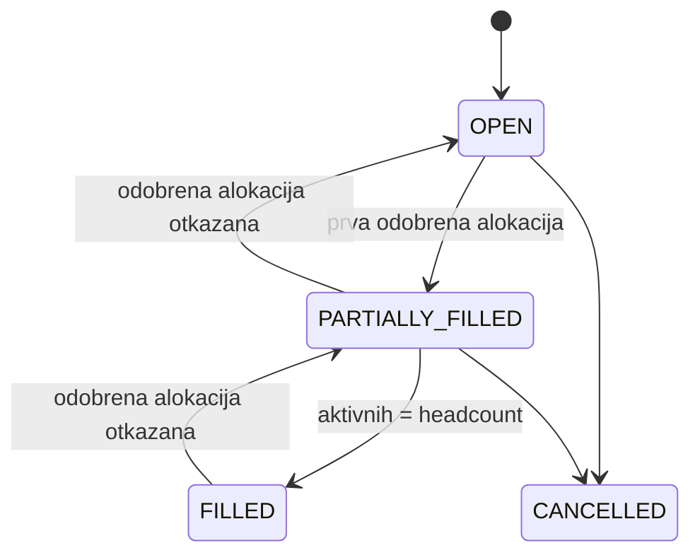

# StaffSync: sistem za raspoređivanje zaposlenih na projekte

> Capstone project proposal · Tim: 3 developera + 1 QA · Trajanje: 3 nedelje
> Radni naziv „StaffSync“ možete da promenite.

---

## Sadržaj

1. [Problem i pitch](#1-problem-i-pitch)
2. [Role](#2-role)
3. [Odluke tima](#3-odluke-tima)
4. [Glavni scenario (demo tok)](#4-glavni-scenario-demo-tok)
5. [Domenski model](#5-domenski-model)
6. [Poslovna pravila](#6-poslovna-pravila)
7. [Kapacitet: kako se računa](#7-kapacitet-kako-se-računa)
8. [Matching engine](#8-matching-engine)
9. [Stanja (workflow)](#9-stanja-workflow)
10. [REST API i Swagger](#10-rest-api-i-swagger)
11. [Angular stranice](#11-angular-stranice)
12. [Tehnologije, arhitektura i Docker](#12-tehnologije-arhitektura-i-docker)
13. [Podela posla](#13-podela-posla)
14. [Plan po nedeljama](#14-plan-po-nedeljama)
15. [Definition of Done](#15-definition-of-done)
16. [QA strategija i matrica testova](#16-qa-strategija-i-matrica-testova)
17. [MVP, stretch i van opsega](#17-mvp-stretch-i-van-opsega)
18. [Rizici](#18-rizici)

---

## 1. Problem i pitch

U većini IT firmi ljudi se raspoređuju na projekte preko Excel tabela, poruka i sastanaka. Posledice su uvek iste:

- **Prebukiranost.** Neko je istovremeno na tri projekta, a zbir zauzetosti mu je 140%, što niko ne primeti dok ne počnu da kasne rokovi.
- **Nevidljivi „bench“.** Ljudi bez projekta postoje, ali ih PM-ovi ne nalaze jer ne znaju ko šta zna niti ko je slobodan.
- **Spor i netransparentan proces.** PM pita line managera u porukama, odgovor se gubi, i nije jasno ko je šta odobrio.

**StaffSync** rešava ovo na jednom mestu. PM opiše koga traži (skillovi, nivo, procenat angažovanja, period), sistem predloži najbolje kandidate na osnovu skillova i stvarne dostupnosti, a line manager (RM) jednim klikom odobri ili odbije. Svaka kasnija izmena alokacije takođe ide RM-u na odobrenje. Pravilo kapaciteta garantuje da niko ne može biti zauzet preko svog kapaciteta.

> **Rečenica za prezentaciju:** „Napravili smo alat kojim biste vi rasporedili nas posle onboardinga.“

---

## 2. Role

| Rola | Opis | Ključne akcije |
|---|---|---|
| **Employee** | Svaki zaposleni | Održava profil i skillove (nivo 1–5), uploaduje CV *(stretch)*, vidi svoje alokacije, prijavljuje odsustva *(stretch)* |
| **Project Manager (PM)** | Vodi jedan ili više projekata | Kreira svoje projekte i staffing zahteve, pregleda rangirane kandidate, predlaže alokacije, traži izmene odobrenih alokacija, otkazuje predloge |
| **Resource Manager (RM)** | Line manager tima zaposlenih | Odobrava ili odbija nove alokacije i izmene alokacija svojih ljudi, odobrava odsustva *(stretch)*, prati zauzetost tima |
| **Admin** | Administracija sistema | Kreira naloge (nema samoregistracije), upravlja rolama, departmentima i katalogom skillova |

Svaki korisnik ima tačno jednu rolu. Svaki Employee ima tačno jednog RM-a (`manager_id`). Na projekte se alociraju samo korisnici sa rolom EMPLOYEE.

---

## 3. Odluke tima

| Tema | Odluka | Zašto |
|---|---|---|
| Role | Jedna rola po korisniku | Jednostavniji JWT, guardovi i meniji |
| Projekti | PM kreira svoje projekte | PM odmah postaje vlasnik projekta, manje koraka |
| Pristanak zaposlenog | Ne traži se, odlučuje samo RM | Jasan tok bez dodatnog koraka |
| **Izmena odobrene alokacije** | **Ide ponovo na odobrenje RM-u** | Realan proces: RM uvek zna i odobrava kako mu je tim zauzet |
| Provera kapaciteta | Pri predlogu upozorenje, pri odobravanju blokada | PM može da planira unapred, a RM ne može da prebukira čoveka |
| Neradni dani | Samo vikendi | Bez dodatne tabele praznika |
| Headcount | Jedan zahtev može tražiti ≥ 1 osobu | Daje statuse `PARTIALLY_FILLED` i `FILLED` |
| **API dokumentacija** | **Swagger (springdoc) sa JWT „Authorize“ i anotacijama** | Obavezno. Služi timu, QA-u i za demo |
| Migracije baze | Flyway | Verzionisana šema, dovoljno je znati SQL |
| UI biblioteka | Angular Material | Gotove tabele, dijalozi, datepicker |
| **Pokretanje** | **Ceo stack u Docker-u** | `docker compose up --build` diže sve za demo |
| Nalozi | Kreira ih Admin, nema registracije | Interni enterprise alat |
| JWT | Samo access token (8h) | Bez refresh tokena |
| CI | Ne koristi se | Testovi se pokreću lokalno pre PR-a |
| **PR review** | **Svaki PR odobrava 1 developer; feature PR dodatno odobrava QA** | Developer proverava kod i arhitekturu, a QA da funkcionalnost radi po specifikaciji |
| QA alati | REST Assured + Playwright | API testovi u Javi, brz i moderan E2E |
| Početna stranica | Jednostavna, po roli (kartice sa brojevima) | Brz pregled, bez grafikona |
| Obaveštenja | Nema | Statusi se vide na listama i na početnoj stranici |
| Jezik | UI i poruke API-ja na engleskom, dokumentacija na srpskom | Standard za enterprise alate |
| Komunikacija | Discord/Teams, a GitHub Issues možda kasnije | Mali tim, brža komunikacija |

---

## 4. Glavni scenario (demo tok)

1. **Ana (PM)** kreira projekat *Project Alpha* (1.11–31.3).
2. Ana kreira staffing zahtev: *„Java Developer“*, MEDIOR, **60%**, 1.11–31.1, headcount 2, skillovi: Java ≥ 4 (obavezno), Spring ≥ 3 (obavezno), PostgreSQL ≥ 2 (poželjno).
3. Sistem vraća **rangiranu listu kandidata**:
   - *Marko, 85/100:* Java 5/5, Spring 4/5, PostgreSQL 3/5, slobodan ceo period (SENIOR, traženo MEDIOR).
   - *Jelena, 67/100:* Java 4/5, Spring 3/5, bez PostgreSQL-a, slobodna 40% do 14.11, a od 15.11 100%. ⚠ Nedovoljan kapacitet 1–14.11.
   - …
4. Ana predlaže Marka. Alokacija dobija status `PROPOSED`.
5. **Igor (RM)**, Markov line manager, vidi zahtev na čekanju i odobrava ga. Alokacija prelazi u `APPROVED`, a zahtev u `PARTIALLY_FILLED` (1 od 2).
6. Ana predlaže Jelenu za ceo period. Njen RM pokušava da odobri, ali sistem odbija sa porukom: *„Capacity exceeded on 2026-11-02 – 2026-11-13 (60% existing + 60% new = 120%)“*.
7. Ana menja period Jeleninog predloga na 15.11–31.1. RM odobrava, a zahtev postaje `FILLED`.
8. Klijent traži više posla, pa Ana šalje **zahtev za izmenu** Markove alokacije: 60% → 80%, uz razlog. Alokacija prelazi u `CHANGE_PENDING`, a dok Igor ne odluči i dalje važi 60%. Igor u listi *Pending approvals* vidi oznaku **Change** i prikaz *60% → 80%*. Odobrava izmenu, a sistem proverava kapacitet za novih 80% i primenjuje ga.

Ovaj tok je ujedno i scenario za demo na prezentaciji.

---

## 5. Domenski model



### Entiteti

| Entitet | Polja | Napomena |
|---|---|---|
| `User` | id, email (unique), passwordHash, firstName, lastName, role, department_id, manager_id, capacityPercent, seniority, active | `capacityPercent` ∈ {100, 80, 50}. `seniority` ∈ {JUNIOR, MEDIOR, SENIOR} |
| `Department` | id, name (unique) | |
| `Skill` | id, name (unique), category | Kategorije: BACKEND, FRONTEND, DATABASE, DEVOPS, QA, OTHER |
| `EmployeeSkill` | id, user_id, skill_id, level (1–5), yearsOfExperience | Kombinacija (user, skill) je unique |
| `Project` | id, name, client, description, startDate, endDate, status, pm_id | Status: PLANNED / ACTIVE / COMPLETED / CANCELLED |
| `StaffingRequest` | id, project_id, title, seniority, allocationPercent, startDate, endDate, headcount, status, createdAt | `allocationPercent` ∈ [10, 100], u koracima od 10 |
| `RequestSkill` | id, request_id, skill_id, minLevel, mandatory | |
| `Allocation` | id, request_id, employee_id, percent, startDate, endDate, status, proposedBy_id, decidedBy_id, decisionComment, createdAt, decidedAt, **pendingPercent, pendingStartDate, pendingEndDate, changeReason** | Status: PROPOSED / APPROVED / **CHANGE_PENDING** / REJECTED / CANCELLED. `percent` se podrazumevano preuzima iz zahteva. `pending*` polja su popunjena samo dok izmena čeka odluku |
| `Absence` *(stretch)* | id, employee_id, type, startDate, endDate, status, decidedBy_id | Type: VACATION / SICK / OTHER |
| `Document` *(stretch)* | id, ownerType, ownerId, fileName, contentType, size, storagePath, uploadedBy_id, uploadedAt | Fajlovi se čuvaju na disku (Docker volume), u bazi su samo metapodaci |

---

## 6. Poslovna pravila

Ova pravila su srž projekta. Implementiraju se u service layer-u, a QA ih pokriva testovima.

> **Aktivna alokacija** je alokacija u statusu `APPROVED` ili `CHANGE_PENDING`. Za `CHANGE_PENDING` važe trenutne (stare) vrednosti dok RM ne odobri izmenu.

| # | Pravilo | Greška |
|---|---|---|
| **BR-1** | **Kapacitet kroz vreme.** Za svaki radni dan u periodu alokacije: zbir aktivnih alokacija zaposlenog + nova alokacija ≤ `capacityPercent`. Dani odobrenog odsustva *(stretch)* se preskaču, jer zaposleni tada ne radi ni na jednom projektu, ali se vraća upozorenje. | 409 Conflict, uz listu dana koji prelaze kapacitet |
| **BR-2** | Provera iz BR-1 je **obavezna pri odobravanju** (nove alokacije i izmene). Pri predlaganju i pri zahtevu za izmenu sistem samo **upozorava** ako bi zbir aktivnih + `PROPOSED` alokacija prešao kapacitet (soft booking). | Pri odobravanju greška; pri predlogu samo upozorenje u odgovoru |
| **BR-3** | Period alokacije (i predložene izmene) mora biti unutar perioda zahteva, a period zahteva unutar perioda projekta. `startDate ≤ endDate`. | 400 Bad Request |
| **BR-4** | Staffing zahteve kreira, kandidate predlaže i izmene traži samo PM tog projekta. | 403 Forbidden |
| **BR-5** | Alokaciju ili izmenu odobrava ili odbija samo RM kome zaposleni pripada (`employee.manager_id`). | 403 Forbidden |
| **BR-6** | Za odbijanje alokacije ili izmene komentar je obavezan (min. 10 karaktera). | 400 Bad Request |
| **BR-7** | Odlučuje se samo o alokacijama u statusu `PROPOSED` ili `CHANGE_PENDING`. O alokaciji koja je već odobrena, odbijena ili otkazana ne može se ponovo odlučivati. | 409 Conflict |
| **BR-8** | Isti zaposleni ne može imati dve alokacije u statusu `PROPOSED`, `APPROVED` ili `CHANGE_PENDING` na istom zahtevu u periodima koji se preklapaju. | 409 Conflict |
| **BR-9** | Predlaganje je dozvoljeno samo na zahtevu u statusu `OPEN` ili `PARTIALLY_FILLED`, i to samo ako zaposleni ispunjava sve obavezne skillove. | 409 / 400 |
| **BR-10** | Status zahteva se računa automatski iz broja aktivnih alokacija: 0 = `OPEN`, između 1 i headcount−1 = `PARTIALLY_FILLED`, headcount = `FILLED`. Kad je zahtev `FILLED`, preostali `PROPOSED` predlozi se automatski otkazuju. | – |
| **BR-11** | Kad se projekat završi ili otkaže: otvoreni zahtevi i `PROPOSED` alokacije se otkazuju, izmene koje čekaju se poništavaju, a aktivne alokacije se skraćuju do tog dana. | – |
| **BR-12** | Korisnik sa aktivnim alokacijama (tekućim ili budućim) ne može biti deaktiviran. | 409 Conflict |
| **BR-13** | Smanjenje `capacityPercent` zaposlenog nije dozvoljeno ako bi postojeće aktivne alokacije prekoračile novi kapacitet. | 409 Conflict |
| **BR-14** *(stretch)* | Odsustvo odobrava RM zaposlenog. Ako se preklapa sa aktivnom alokacijom, odobravanje je dozvoljeno, ali se konflikt prikazuje PM-u i RM-u. | Upozorenje |
| **BR-15** | **Izmena odobrene alokacije.** PM može tražiti izmenu procenta, početka i/ili kraja samo za `APPROVED` alokaciju koja se nije završila, uz obavezan razlog. Može čekati samo jedna izmena u isto vreme. Alokacija koja je već počela ne može promeniti `startDate`. Kad RM odobri izmenu, kapacitet (BR-1) se proverava za nove vrednosti bez trenutnih vrednosti te iste alokacije, i nove vrednosti se primenjuju. Kad RM odbije ili PM povuče izmenu, ostaju stare vrednosti. U svim slučajevima status se vraća na `APPROVED`. | 409 (pogrešan status, izmena već čeka), 400 (validacija) |
| **BR-16** | `CHANGE_PENDING` alokacija se u kapacitetu (BR-1), statusu zahteva (BR-10) i deaktivaciji (BR-12) računa kao aktivna, sa trenutnim vrednostima. | – |

---

## 7. Kapacitet: kako se računa

**Zašto procenat, a ne sati?** U IT firmama se o raspoređivanju priča u procentima („50% na projektu A“), a sati su tema timesheet-a i naplate. Procenat daje jedno pravilo umesto da se prate različiti ugovori i praznici. Za prikaz u UI-ju se procenat preračunava u sate: 60% od 40h = 24h nedeljno.

**Algoritam.** `CapacityService.getDailyLoad(employeeId, from, to, excludeAllocationId)` vraća mapu `datum → zauzetost u %` samo za radne dane (pon–pet). Parametar `excludeAllocationId` služi za izmene (BR-15): alokacija koja se menja ne računa se dvaput. Periodi su najviše nekoliko meseci, pa je prolazak dan po dan sasvim dovoljno brz, a kod ostaje čitljiv i lak za testiranje.

```text
Marko, capacityPercent = 100
  Projekat A: 60%, 1.11–15.12   (APPROVED)
  Projekat B: 30%, 10.11–31.12  (APPROVED)
  Odsustvo:   12.11–14.11       (APPROVED)

Novi predlog: Projekat C, 20%, 5.11–20.11

  5.11–9.11:   60        + 20 =  80% ✅
  10.11–11.11: 60 + 30   + 20 = 110% ❌
  12.11–13.11: odsustvo, preskače se ⚠
  16.11–20.11: 60 + 30   + 20 = 110% ❌

=> 409 CAPACITY_EXCEEDED za 10.11–11.11 i 16.11–20.11
```

```text
Izmena: Projekat A 60% → 70%, isti period (1.11–15.12)

  Računa se bez trenutnih 60% za Projekat A:
  2.11–9.11:   70          =  70% ✅
  10.11–15.12: 30 + 70     = 100% ✅  (tačno 100% je dozvoljeno)
  12.11–13.11: odsustvo, preskače se ⚠

=> 200: Projekat A je sada 70%, uz upozorenje za odsustvo 12.11–13.11
```

**Slobodan kapacitet** za dan = `capacityPercent − zauzetost`, a na dan odsustva je 0, pa odsustvo smanjuje skor dostupnosti u matchingu. Isti metod koriste matching engine, pretraga zaposlenih i početna stranica.

---

## 8. Matching engine

`GET /api/requests/{id}/candidates` vraća kandidate sortirane po skoru (0–100), sa objašnjenjem.

### Korak 1: filter
- Zaposleni je aktivan i ima rolu EMPLOYEE.
- Zaposleni ima **sve obavezne** skillove na nivou ≥ `minLevel`.
- Zaposleni nema aktivnu ili predloženu alokaciju na istom zahtevu.

### Korak 2: skor

| Komponenta | Težina | Računanje |
|---|---|---|
| **Skillovi** | 50% | Za svaki traženi skill se računa poklapanje: obavezni skill na minimalnom nivou = 0,7, svaki nivo iznad minimuma +0,1 (najviše 1,0); poželjni skill nosi isto, a ako ga kandidat nema = 0. Prosek se množi sa 50. |
| **Dostupnost** | 40% | Udeo radnih dana u periodu na kojima je slobodan kapacitet ≥ traženi procenat. Množi se sa 40. |
| **Seniority** | 10% | Isti nivo = 10, susedni nivo = 5, ostalo = 0. |

### Korak 3: objašnjenje
Svaki kandidat u odgovoru ima `reasons[]` i `warnings[]`. Tekstovi su na engleskom, kao i ceo UI:

```json
{
  "employeeId": 17,
  "fullName": "Jelena Petrović",
  "score": 67,
  "breakdown": { "skills": 23, "availability": 34, "seniority": 10 },
  "reasons": ["Java 4/5 (required ≥ 4)", "Spring 3/5 (required ≥ 3)"],
  "warnings": ["Insufficient capacity 2026-11-02 – 2026-11-13 (40% free, 60% required)", "Missing PostgreSQL (nice to have)"]
}
```

Ovo je deo koji projekat odvaja od običnog CRUD-a. `MatchingService` zavisi samo od `CapacityService` i repozitorijuma, pa se skor lako testira jediničnim testovima sa mock podacima.

---

## 9. Stanja (workflow)

### Allocation



### Staffing request



### Project
`PLANNED → ACTIVE → COMPLETED`; iz `PLANNED` ili `ACTIVE` projekat može preći u `CANCELLED` (vidi BR-11).

---

## 10. REST API i Swagger

Svi endpointi osim login-a i Swagger-a zahtevaju JWT (`Authorization: Bearer …`). Liste podržavaju `page`, `size` i `sort`.

### Swagger / OpenAPI (obavezno)

- **Dependency:** `org.springdoc:springdoc-openapi-starter-webmvc-ui`
- **Swagger UI:** `http://localhost:8080/swagger-ui.html`; **OpenAPI JSON:** `http://localhost:8080/v3/api-docs`
- U `SecurityConfig` su `/swagger-ui.html`, `/swagger-ui/**` i `/v3/api-docs/**` označeni kao `permitAll`.
- Klasa `OpenApiConfig` definiše naziv i verziju API-ja i JWT security scheme. Zbog nje Swagger UI ima dugme **Authorize**: tu se nalepi token dobijen sa `/api/auth/login` i zaštićeni endpointi se mogu isprobati direktno iz browsera.
- Svaki kontroler ima `@Tag`, svaki endpoint `@Operation(summary = …)` i `@ApiResponse` za bitne greške (400, 403, 409), a DTO-i za zahteve imaju `@Schema(example = …)`.
- Swagger anotacije su deo [Definition of Done](#15-definition-of-done). QA koristi Swagger za istraživačko testiranje i kao referencu za REST Assured testove, a Swagger se pokazuje i na prezentaciji.

```java
@Configuration
@OpenAPIDefinition(info = @Info(title = "StaffSync API", version = "v1"))
@SecurityScheme(name = "bearerAuth", type = SecuritySchemeType.HTTP,
        scheme = "bearer", bearerFormat = "JWT")
public class OpenApiConfig {
}
```

```java
@RestController
@RequestMapping("/api/allocations")
@Tag(name = "Allocations", description = "Propose, approve, reject and change allocations")
@SecurityRequirement(name = "bearerAuth")
public class AllocationController {

    @Operation(summary = "Approve a proposed allocation or a pending change")
    @ApiResponse(responseCode = "200", description = "Approved")
    @ApiResponse(responseCode = "403", description = "Not the employee's resource manager")
    @ApiResponse(responseCode = "409", description = "Capacity exceeded or invalid status")
    @PostMapping("/{id}/approve")
    public AllocationDto approve(@PathVariable Long id) {
        return allocationService.approve(id);
    }
}
```

### Auth
| Metod | Putanja | Rola | Opis |
|---|---|---|---|
| POST | `/api/auth/login` | javno | Vraća JWT (važi 8h) i osnovne podatke o korisniku. Neaktivan korisnik dobija 401 |
| GET | `/api/auth/me` | svi | Trenutni korisnik |
| PUT | `/api/auth/password` | svi | Promena sopstvene lozinke (stara + nova, min. 8 karaktera) |

### Početna stranica
| Metod | Putanja | Rola | Opis |
|---|---|---|---|
| GET | `/api/dashboard` | svi | Kartice sa brojevima, prilagođene roli korisnika (vidi sekciju 11) |

### Korisnici, departmenti, skillovi
| Metod | Putanja | Rola | Opis |
|---|---|---|---|
| GET | `/api/users` | ADMIN, RM | Lista sa filterima (department, role, active) |
| POST | `/api/users` | ADMIN | Kreiranje naloga sa privremenom lozinkom (nema samoregistracije) |
| PUT | `/api/users/{id}` | ADMIN | Izmena (BR-13) |
| PATCH | `/api/users/{id}/deactivate` | ADMIN | Deaktivacija (BR-12) |
| GET / PUT | `/api/users/{id}/skills` | vlasnik, ADMIN (izmena); svi (čitanje) | Skillovi zaposlenog |
| GET | `/api/users/{id}/availability?from&to` | PM, RM, vlasnik | Dnevna zauzetost i slobodan kapacitet |
| GET | `/api/users/me/team` | RM | Moj tim sa trenutnom zauzetošću |
| CRUD | `/api/departments` | ADMIN (izmena), svi (čitanje) | |
| CRUD | `/api/skills` | ADMIN (izmena), svi (čitanje) | |

### Projekti i zahtevi
| Metod | Putanja | Rola | Opis |
|---|---|---|---|
| GET | `/api/projects?status&pmId` | svi | Lista projekata |
| POST / PUT | `/api/projects`, `/api/projects/{id}` | PM | Kreiranje i izmena sopstvenog projekta |
| PATCH | `/api/projects/{id}/status` | PM (vlasnik) | Promena statusa (BR-11) |
| GET / POST | `/api/projects/{id}/requests` | PM (vlasnik); svi (čitanje) | Staffing zahtevi projekta (BR-3, BR-4) |
| GET / PUT / DELETE | `/api/requests/{id}` | PM (vlasnik) | Detalji, izmena, otkazivanje |
| GET | `/api/requests/{id}/candidates` | PM (vlasnik) | **Matching engine** |

### Alokacije
| Metod | Putanja | Rola | Opis |
|---|---|---|---|
| POST | `/api/allocations` | PM | Predlog (BR-2, BR-3, BR-8, BR-9) |
| GET | `/api/allocations?status&employeeId&projectId&from&to` | svi (filtrirano po roli) | Pretraga alokacija |
| GET | `/api/allocations/pending` | RM | Na čekanju za moj tim. Svaka stavka ima `type`: `NEW` (novi predlog) ili `CHANGE` (izmena, sa starim i novim vrednostima) |
| POST | `/api/allocations/{id}/approve` | RM | Odobrava novi predlog ili izmenu (BR-1, BR-5, BR-7, BR-10, BR-15) |
| POST | `/api/allocations/{id}/reject` | RM | Odbija novi predlog ili izmenu (BR-5, BR-6, BR-7, BR-15) |
| POST | `/api/allocations/{id}/cancel` | PM | Povlačenje predloga ili otkazivanje odobrene alokacije pre početka |
| POST | `/api/allocations/{id}/change-request` | PM | Zahtev za izmenu: `percent`, `startDate`, `endDate`, `reason` (BR-3, BR-4, BR-15) |
| DELETE | `/api/allocations/{id}/change-request` | PM | Povlačenje izmene koja čeka (BR-15) |

### Pretraga zaposlenih
| Metod | Putanja | Rola | Opis |
|---|---|---|---|
| GET | `/api/employees/search?skillId&minLevel&seniority&departmentId&availableFrom&availableTo&minFreePercent` | PM, RM | Napredna pretraga sa paginacijom i sortiranjem |

### Stretch
| Metod | Putanja | Rola | Opis |
|---|---|---|---|
| GET / POST | `/api/absences` | EMPLOYEE (svoja), RM (tim) | Prijava i pregled odsustava |
| POST | `/api/absences/{id}/approve`, `/reject` | RM | BR-14 |
| POST | `/api/documents` (multipart) | vlasnik / PM | Upload CV-a ili dokumenta projekta (PDF/DOCX, max 5 MB) |
| GET / DELETE | `/api/documents/{id}` | ovlašćeni | Download i brisanje |
| GET | `/api/users/me/team/timeline?from&to` | RM | Nedeljna zauzetost tima za heatmap |

### Format greške (globalni `@ControllerAdvice`)
```json
{
  "timestamp": "2026-11-03T10:15:30Z",
  "status": 409,
  "code": "CAPACITY_EXCEEDED",
  "message": "Capacity exceeded on 3 days",
  "details": [{ "date": "2026-11-10", "load": 110 }]
}
```

---

## 11. Angular stranice

UI je na **engleskom**.

**Zajedničko:** login, layout sa menijem koji zavisi od role, `AuthGuard` i `RoleGuard`, JWT `HttpInterceptor` (na 401 briše token i vraća korisnika na login), globalni error handler (snackbar), *Change password* dijalog, pretraga zaposlenih.

**Početna stranica (*Home*)** je za svaku rolu nekoliko Material kartica sa brojem i linkom ka listi. Nema grafikona.

| Rola | Kartice na početnoj stranici |
|---|---|
| Employee | Trenutna ukupna zauzetost (%), broj aktivnih projekata, sledeća alokacija |
| PM | Aktivni projekti, otvoreni zahtevi, predlozi i izmene koji čekaju RM-a |
| RM | Odluke na čekanju, broj ljudi iz tima na bench-u ove nedelje (0% zauzetosti), prosečna zauzetost tima |
| Admin | Broj aktivnih korisnika, aktivnih projekata i skillova u katalogu |

| Rola | Stranice |
|---|---|
| **Employee** | *My profile* (podaci, skillovi sa nivoima, CV upload *(stretch)*), *My allocations* (lista i trenutna zauzetost), *My absences* *(stretch)* |
| **PM** | *My projects* (lista i filteri), *Project details* (zahtevi, tim, dokumenti), *New/Edit request* (reactive form sa dinamičkom listom skillova), **Candidates** (rangirana lista, breakdown skora, upozorenja, dugme *Propose*), *Request change* dijalog na odobrenoj alokaciji (novi %, datumi, razlog) |
| **RM** | **Pending approvals** (oznaka *New*/*Change*; za izmenu prikaz staro → novo; approve/reject dijalog sa komentarom), *My team* (lista sa trenutnom zauzetošću), **Timeline/heatmap** *(stretch)* (redovi = ljudi, kolone = nedelje, boja = zauzetost) |
| **Admin** | *Users* (kreiranje naloga sa privremenom lozinkom), *Departments*, *Skills catalog* |

**Reusable komponente:** `skill-level-picker`, `capacity-bar` (traka zauzetosti), `status-chip`, `date-range-picker`, `confirm-dialog`, `paged-table`, `stat-card` (kartica na početnoj stranici), `change-diff` (prikaz staro → novo).

---

## 12. Tehnologije, arhitektura i Docker

| Sloj | Tehnologije |
|---|---|
| Backend | Java 21, Spring Boot 3, Spring Web, Spring Data JPA, Spring Security + JWT, Bean Validation, Flyway, **springdoc-openapi (Swagger UI)** |
| Baza | PostgreSQL 16 |
| Frontend | Angular (standalone komponente), Angular Material, Reactive Forms, RxJS |
| Testovi | JUnit 5, Mockito, Spring Boot Test, Testcontainers, REST Assured, Playwright |
| Infrastruktura | Docker + Docker Compose (ceo stack) |
| Alati | Git (feature grane, PR, code review), Discord/Teams za komunikaciju i zadatke. GitHub Issues su opcija za kasnije |

### Struktura repozitorijuma
```text
Capstone-project/
├── backend/             (Spring Boot, Maven, Dockerfile)
├── frontend/            (Angular, Dockerfile, nginx.conf)
├── docs/                (proposal, test plan)
├── docker-compose.yml
└── .env.example         (DB_USER, DB_PASSWORD, JWT_SECRET, ...)
```

### Struktura backenda (paketi po feature-ima)
```text
com.staffsync
├── auth/          (JwtService, SecurityConfig, AuthController)
├── config/        (OpenApiConfig)
├── dashboard/     (DashboardController, DashboardService)
├── user/          (User, UserController, UserService, UserRepository, dto/)
├── skill/
├── department/
├── project/
├── request/       (StaffingRequest, RequestSkill, ...)
├── allocation/    (Allocation, AllocationService, CapacityService)
├── matching/      (MatchingService, CandidateDto)
├── absence/       (stretch)
├── document/      (stretch)
└── common/        (GlobalExceptionHandler, BusinessException, ErrorResponse)
```

Slojevi: **Controller → Service → Repository**. Entiteti se nikad ne vraćaju direktno, već preko DTO-a. Poslovna pravila žive isključivo u servisima.

### Docker: ceo stack

`docker compose up --build` diže celu aplikaciju jednom komandom:

| Servis | Image / build | Port | Napomena |
|---|---|---|---|
| `db` | `postgres:16` | 5432 | Named volume za podatke, healthcheck `pg_isready` |
| `backend` | `backend/Dockerfile`: multi-stage (Maven build → JRE 21) | 8080 | Čeka da `db` bude healthy. Swagger UI je na `:8080/swagger-ui.html` |
| `frontend` | `frontend/Dockerfile`: multi-stage (Angular build → nginx) | 4200 → 80 | nginx servira aplikaciju i prosleđuje `/api` na `backend` |

```yaml
services:
  db:
    image: postgres:16
    environment:
      POSTGRES_DB: staffsync
      POSTGRES_USER: ${DB_USER}
      POSTGRES_PASSWORD: ${DB_PASSWORD}
    volumes:
      - db-data:/var/lib/postgresql/data
    ports:
      - "5432:5432"
    healthcheck:
      test: ["CMD-SHELL", "pg_isready -U ${DB_USER} -d staffsync"]
      interval: 5s
      retries: 10

  backend:
    build: ./backend
    environment:
      SPRING_DATASOURCE_URL: jdbc:postgresql://db:5432/staffsync
      SPRING_DATASOURCE_USERNAME: ${DB_USER}
      SPRING_DATASOURCE_PASSWORD: ${DB_PASSWORD}
      JWT_SECRET: ${JWT_SECRET}
    depends_on:
      db:
        condition: service_healthy
    ports:
      - "8080:8080"

  frontend:
    build: ./frontend
    depends_on:
      - backend
    ports:
      - "4200:80"

volumes:
  db-data:
```

**Tokom razvoja** se pokreće samo baza (`docker compose up db`), a backend i frontend iz IDE-a, zbog bržeg rada i hot reload-a. Ceo stack se koristi za proveru pre većih merge-ova i za demo.

### Flyway: pravila
- Migracije su u `backend/src/main/resources/db/migration/` i zovu se `V{broj}__{opis}.sql`, npr. `V3__create_allocation.sql`.
- `spring.jpa.hibernate.ddl-auto=validate`: šemu menja isključivo Flyway, a Hibernate samo proverava da se entiteti i tabele slažu.
- **Migracija se nikad ne menja posle merge-a.** Svaka promena je nova migracija.
- Pre pravljenja migracije, sledeći broj se „rezerviše“ porukom na Discord/Teams kanalu, da dva developera ne bi napravila isti `V5`.
- Ako se lokalna baza pokvari, reset je `docker compose down -v`. Seed migracije sve vraćaju.

### Seed podaci
Flyway migracije sa demo podacima: 1 admin, 4 departmenta, oko 25 skillova, oko 30 zaposlenih sa različitim skillovima i kapacitetima (uključujući part-time), 3 PM-a, 3 RM-a, 5 projekata i nekoliko postojećih alokacija, tako da matching i početna stranica imaju šta da pokažu. Svaki developer pravi seed za entitete svog dela.

### Autentifikacija
- Nema samoregistracije. Admin kreira naloge sa privremenom lozinkom, a prvi admin dolazi iz seed podataka.
- Lozinke se čuvaju kao BCrypt hash. Korisnik menja lozinku preko `PUT /api/auth/password`.
- JWT je samo access token, važi 8h i nema refresh tokena. Tajni ključ se čita iz `JWT_SECRET` env promenljive.

### Kvalitet bez CI-ja
CI se ne koristi. Zato je pravilo da se **pre otvaranja PR-a** lokalno pokrene `mvn verify` (backend), odnosno `ng build` i `ng test` (frontend). QA pušta regresione testove pre većih merge-ova u `main`.

---

## 13. Podela posla

Rad je podeljen na vertikalne slice-ove: svaki developer radi i backend i frontend svog dela (50/50).

| Član | Odgovornost |
|---|---|
| **Dev 1: Platforma i korisnici** | Setup projekta (Spring Boot, Angular, Flyway), Docker (baza u prvoj nedelji, ceo stack u trećoj), Spring Security + JWT, **Swagger konfiguracija** (`OpenApiConfig`, Authorize), guardovi i interceptor, korisnici (kreiranje naloga, promena lozinke), departmenti, profil zaposlenog sa skillovima, admin stranice, **početna stranica** (`/api/dashboard` i *Home*). *Stretch:* upload dokumenata. |
| **Dev 2: Projekti i matching** | Katalog skillova, projekti, staffing zahtevi (forma sa dinamičkim skillovima), **MatchingService**, stranica kandidata, pretraga zaposlenih, PM stranice. *Stretch:* timeline/heatmap. |
| **Dev 3: Alokacije i kapacitet** | **CapacityService**, alokacije (predlog, odobravanje, odbijanje, otkazivanje), **tok izmene alokacije** (BR-15, BR-16), automatski status zahteva, RM stranice (*Pending approvals* sa *New*/*Change*), availability endpoint. *Stretch:* odsustva. |
| **QA** | Test plan, matrica testova iz poslovnih pravila, unit testovi za `CapacityService` i `MatchingService`, integracioni testovi (Testcontainers), API automatizacija (REST Assured), E2E (Playwright), matrica ovlašćenja, istraživačko testiranje kroz Swagger, **testiranje i odobravanje feature PR-ova pre merge-a**, prijava bagova na Discord/Teams kanalu (ili kroz GitHub Issues, ako ih uvedete). |

Svaki developer sam piše Swagger anotacije za svoje endpointe.

### Git workflow i PR review

`main` je uvek stabilan. Feature grane se zovu `feature/<kratak-opis>`. Dogovori i podela zadataka idu preko Discord/Teams kanala.

| Vrsta PR-a | Ko odobrava | Šta proverava |
|---|---|---|
| **Svaki PR** | **1 developer (obavezno)** | Kod i arhitektura, poslovna pravila u servisu, DTO-i, validacija, Swagger anotacije |
| **Feature PR** (nova funkcionalnost koju korisnik vidi) | **+ QA (drugo odobrenje)** | Pokreće granu lokalno, isproba je kroz Swagger i UI, proverava pravila iz matrice testova, validacije i poruke grešaka |
| Tehnički PR (setup, konfiguracija, refaktor) | Samo developer | QA nije potreban |

QA-ovo odobrenje znači **„testirano i radi po specifikaciji“**, a ne „kod je dobar“. Za kvalitet koda odgovara developer koji radi review.

**Da QA ne bi kočio rad:**
- QA pregleda feature PR **u roku od pola radnog dana** od otvaranja.
- PR-ovi su mali: jedan endpoint ili jedan ekran, a ne nedelja rada.
- Ako QA ne stigne u roku, PR se merge-uje sa odobrenjem developera, a QA ga testira naknadno na `main` i bagove prijavljuje na kanalu.
- Autor PR-a u opisu navodi šta treba testirati i na koja pravila (BR-x) se PR odnosi.

---

## 14. Plan po nedeljama

### Nedelja 1: temelji
| Član | Zadaci |
|---|---|
| Dev 1 | Kostur repoa i oba projekta, `docker-compose.yml` sa bazom, Flyway V1, auth/JWT end-to-end (login stranica), **Swagger sa Authorize dugmetom**, layout i guardovi |
| Dev 2 | Katalog skillova, entiteti i CRUD za projekte i staffing zahteve (backend), PM lista projekata |
| Dev 3 | Entiteti za alokacije, `CapacityService` sa unit testovima za osnovne slučajeve, availability endpoint |
| QA | Test plan, test case-ovi iz BR-1…BR-16, setup REST Assured, Testcontainers i Playwright projekta, test podaci za granične slučajeve, **unit testovi za `CapacityService` iz primera iz sekcije 7 pre implementacije**, API testovi prema dogovorenim DTO-ima, upoznavanje API-ja kroz Swagger, testiranje prvih feature PR-ova |

**Cilj kraja nedelje:** login radi, korisnici, skillovi i projekti postoje u bazi i vide se u UI-ju, a svi endpointi se vide u Swagger-u.

### Nedelja 2: srž sistema
| Član | Zadaci |
|---|---|
| Dev 1 | Profil i skillovi zaposlenog, admin stranice (kreiranje naloga), promena lozinke, **početna stranica po roli** |
| Dev 2 | `MatchingService`, stranica kandidata, forma zahteva, pretraga zaposlenih |
| Dev 3 | Tok predlog → odobravanje/odbijanje, **tok izmene alokacije**, BR-1…BR-16, RM stranice |
| QA | Testiranje i odobravanje feature PR-ova, API testovi za alokacije, izmene i ovlašćenja, unit testovi za capacity i matching, bug reportovi |

**Cilj kraja nedelje:** ceo demo scenario iz sekcije 4 (uključujući izmenu u koraku 8) radi od početka do kraja.

### Nedelja 3: stretch, kvalitet i prezentacija
| Dan | Fokus |
|---|---|
| 1–2 | **Docker ceo stack** (Dev 1), stretch: upload dokumenata (Dev 1), odsustva (Dev 3), timeline/heatmap (Dev 2) |
| 3 | Završetak stretch funkcionalnosti; **feature freeze** na kraju dana |
| 4 | Ispravljanje bagova, UI polish, finalni seed podaci, provera da sve radi kroz `docker compose up --build` |
| 5 | Probna prezentacija, demo scenario, README sa uputstvom za pokretanje |

QA u trećoj nedelji radi E2E testove glavnog toka, regresiju i finalni test izveštaj.

---

## 15. Definition of Done

Funkcionalnost je gotova kada:

- [ ] je kod pregledan i odobren od bar jednog drugog developera (PR review)
- [ ] postoje validacija ulaza (Bean Validation) i obrada grešaka u standardnom formatu
- [ ] svaki novi endpoint ima **Swagger anotacije** (`@Tag`, `@Operation`, `@ApiResponse`) i može se isprobati kroz Swagger UI
- [ ] je promena šeme urađena kroz novu Flyway migraciju
- [ ] lokalno prolaze `mvn verify` i `ng build` / `ng test`
- [ ] radi kroz `docker compose up --build`
- [ ] je za feature PR **QA testirao granu i odobrio PR**: glavni tok i pravila iz matrice testova koja se odnose na tu funkcionalnost. Ako je PR merge-ovan bez QA-a zbog roka, QA ga je testirao na `main`

---

## 16. QA strategija i matrica testova

### Nivoi testiranja
- **Unit:** `CapacityService` (zbir po danu, granice perioda, vikendi, odsustva, isključivanje alokacije koja se menja), `MatchingService` (filter, skor, sortiranje).
- **Integracioni:** repozitorijumi i servisi nad pravim PostgreSQL-om (Testcontainers).
- **API:** REST Assured, svi endpointi, statusni kodovi i format grešaka. Swagger je referenca za zahteve i odgovore.
- **E2E:** Playwright, glavni scenario po rolama.
- **Ovlašćenja:** matrica rola × endpoint (200 / 403 / 401).

### QA od prvog dana (shift-left)
QA ne čeka da developeri završe, nego radi paralelno sa njima:
- **Pre implementacije:** test case-ovi iz poslovnih pravila, test podaci i automatski testovi napisani prema specifikaciji. Primeri iz sekcija 7 i 8 su gotovi test case-ovi za `CapacityService` i `MatchingService`, a dogovoreni DTO-i su osnova za REST Assured testove. Ovi testovi „čekaju“ implementaciju i prolaze kad je posao gotov.
- **Tokom implementacije:** testiranje i odobravanje feature PR-ova (vidi [Git workflow i PR review](#git-workflow-i-pr-review)).
- **Posle merge-a:** regresija na `main` pre većih merge-ova i E2E testovi glavnog toka.

### Matrica testova (izvod)

| ID | Pravilo | Scenario | Očekivano |
|---|---|---|---|
| T-01 | BR-1 | Postojeće 40% + novo 60% = tačno 100% | 200, APPROVED |
| T-02 | BR-1 | Postojeće 50% + novo 60% = 110% | 409 CAPACITY_EXCEEDED |
| T-03 | BR-1 | Postojeća alokacija se završava 10.11, nova počinje 10.11 (preklapanje na granici) | 409 ako zbir > 100 |
| T-04 | BR-1 | Postojeća se završava 9.11, nova počinje 10.11 | 200 |
| T-05 | BR-1 | Part-time (50%) zaposleni, novo 60% | 409 |
| T-06 | BR-1 | Preklapanje samo vikendom | 200 (vikendi se ne računaju) |
| T-07 | BR-1 | Odobreno odsustvo usred perioda alokacije *(stretch)* | 200 + upozorenje (dani odsustva se preskaču) |
| T-08 | BR-2 | Predlog koji sa PROPOSED alokacijama prelazi kapacitet | 201 + upozorenje |
| T-09 | BR-3 | Alokacija počinje pre početka zahteva | 400 |
| T-10 | BR-3 | `endDate` < `startDate` | 400 |
| T-11 | BR-4 | PM predlaže na tuđem projektu | 403 |
| T-12 | BR-5 | RM odobrava zaposlenog iz drugog tima | 403 |
| T-13 | BR-5 | Employee pokušava da odobri | 403 |
| T-14 | BR-6 | Odbijanje bez komentara ili sa komentarom kraćim od 10 karaktera | 400 |
| T-15 | BR-7 | Ponovno odobravanje APPROVED alokacije | 409 |
| T-16 | BR-8 | Isti zaposleni predložen dvaput na isti zahtev | 409 |
| T-17 | BR-9 | Predlog na FILLED ili CANCELLED zahtev | 409 |
| T-18 | BR-9 | Predlog zaposlenog bez obaveznog skilla | 400 |
| T-19 | BR-10 | Headcount 2, odobrene 2 alokacije | Zahtev FILLED, ostali predlozi CANCELLED |
| T-20 | BR-10 | Otkazana odobrena alokacija na FILLED zahtevu | Zahtev PARTIALLY_FILLED |
| T-21 | BR-11 | Projekat otkazan | Otvoreni zahtevi i PROPOSED alokacije CANCELLED, izmene koje čekaju poništene |
| T-22 | BR-12 | Deaktivacija zaposlenog sa aktivnom alokacijom | 409 |
| T-23 | BR-13 | Smanjenje kapaciteta sa 100% na 50% uz postojećih 80% | 409 |
| T-24 | Matching | Kandidat bez obaveznog skilla | Nije u listi |
| T-25 | Matching | Dva kandidata, isti skillovi, različita dostupnost | Dostupniji je rangiran više |
| T-26 | Auth | Istekao JWT | 401 |
| T-27 | Auth | Pogrešna lozinka | 401, bez otkrivanja da li email postoji |
| T-28 | Upload *(stretch)* | Fajl > 5 MB ili `.exe` | 400 |
| T-29 | BR-15 | Izmena 60% → 80% kada ima kapaciteta, RM odobri | 200, APPROVED sa 80% |
| T-30 | BR-15, BR-1 | Izmena koja prelazi kapacitet, RM pokuša da odobri | 409, alokacija ostaje APPROVED sa starim vrednostima |
| T-31 | BR-15 | Nova izmena dok prethodna čeka | 409 |
| T-32 | BR-15 | Promena `startDate` za alokaciju koja je već počela | 400 |
| T-33 | BR-15 | Zahtev za izmenu PROPOSED, REJECTED ili završene alokacije | 409 |
| T-34 | BR-6, BR-15 | Odbijanje izmene bez komentara | 400 |
| T-35 | BR-15 | PM povuče izmenu koja čeka | 200, APPROVED sa starim vrednostima |
| T-36 | BR-16 | Alokacija u CHANGE_PENDING na FILLED zahtevu | Zahtev ostaje FILLED, a kapacitet se računa sa starim vrednostima |
| T-37 | Auth | Login neaktivnog korisnika | 401 |
| T-38 | Auth | Promena lozinke sa pogrešnom starom lozinkom | 400 |
| T-39 | Swagger | `/swagger-ui.html` bez tokena; zaštićeni endpoint iz Swagger-a bez Authorize | 200; 401 |
| T-40 | Dashboard | Svaka rola poziva `/api/dashboard` | Svaka rola dobija samo svoje kartice i podatke |

---

## 17. MVP, stretch i van opsega

### MVP (mora da bude gotovo)
- Auth (JWT, 8h), 4 role sa guardovima, kreiranje naloga od strane admina, promena lozinke
- Korisnici, departmenti, skillovi, profil zaposlenog
- Projekti i staffing zahtevi
- **Matching engine** sa skorom i objašnjenjem
- **Tok alokacija** sa pravilima BR-1 do BR-13
- **Izmena odobrene alokacije** uz ponovno odobravanje (BR-15, BR-16)
- Pretraga zaposlenih po skillu i dostupnosti
- Početna stranica po roli
- **Swagger** dokumentacija svih endpointa
- **Docker:** ceo stack kroz `docker compose up --build`
- Seed podaci i demo scenario

### Stretch (redosledom prioriteta)
1. **Odsustva:** prijava, odobravanje, uticaj na kapacitet (BR-14)
2. **Upload CV-a i dokumenata projekta**
3. **Timeline/heatmap** zauzetosti tima

### Van opsega (svesno izostavljeno)
- Email i in-app obaveštenja, real-time (WebSocket)
- Samoregistracija korisnika, refresh token
- CI/CD i deploy na cloud
- Analitika, grafikoni i izveštaji
- Audit log
- Mikroservisi, Kafka, AI

---

## 18. Rizici

| Rizik | Mitigacija |
|---|---|
| Matching ispadne previše jednostavan i projekat izgleda kao CRUD | Matching i capacity su prioritet u drugoj nedelji, a objašnjenje skora je obavezan deo MVP-a |
| Greške u računanju kapaciteta na granicama datuma i kod izmena | Pravila su definisana unapred (sekcije 6 i 7), a QA piše testove za granice pre implementacije |
| Tok izmene alokacije poveća obim posla za Dev 3 | Izmena koristi iste endpointe za approve/reject i isti `CapacityService`. Dashboard i Docker su kod Dev 1, a heatmap kod Dev 2 |
| Integracija frontenda i backenda kasni | API ugovor (DTO-i) dogovoren u prvoj nedelji i vidljiv u Swagger-u, a frontend može da radi sa mock podacima |
| Docker setup za ceo stack oduzme previše vremena | Baza je u Docker-u od prvog dana, a ceo stack se radi u trećoj nedelji. Rezervna opcija za demo je da se backend i frontend pokrenu lokalno |
| Bez CI-ja se pokvari `main` | `mvn verify` i `ng build` lokalno pre svakog PR-a, obavezan review, regresija pre većih merge-ova |
| Konflikt brojeva Flyway migracija | Broj migracije se rezerviše na kanalu, a lokalna baza se resetuje sa `docker compose down -v` |
| QA postane usko grlo za PR-ove | Rok od pola radnog dana, mali PR-ovi; ako QA ne stigne, merge sa odobrenjem developera, pa QA testira na `main` |
| Previše stretch funkcionalnosti | Feature freeze na kraju 3. dana treće nedelje, bez izuzetaka |
| Merge konflikti u istim fajlovima | Paketi po feature-ima, mali i česti PR-ovi |
